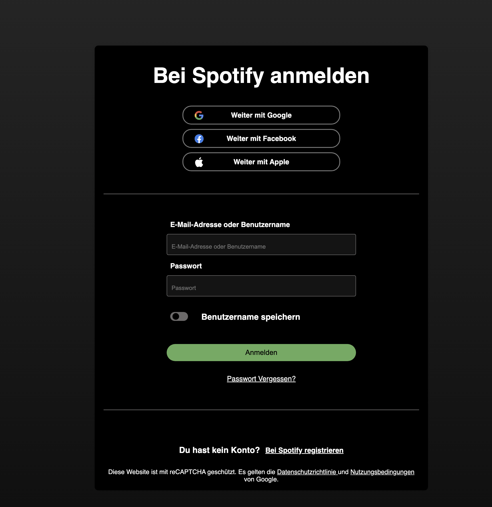
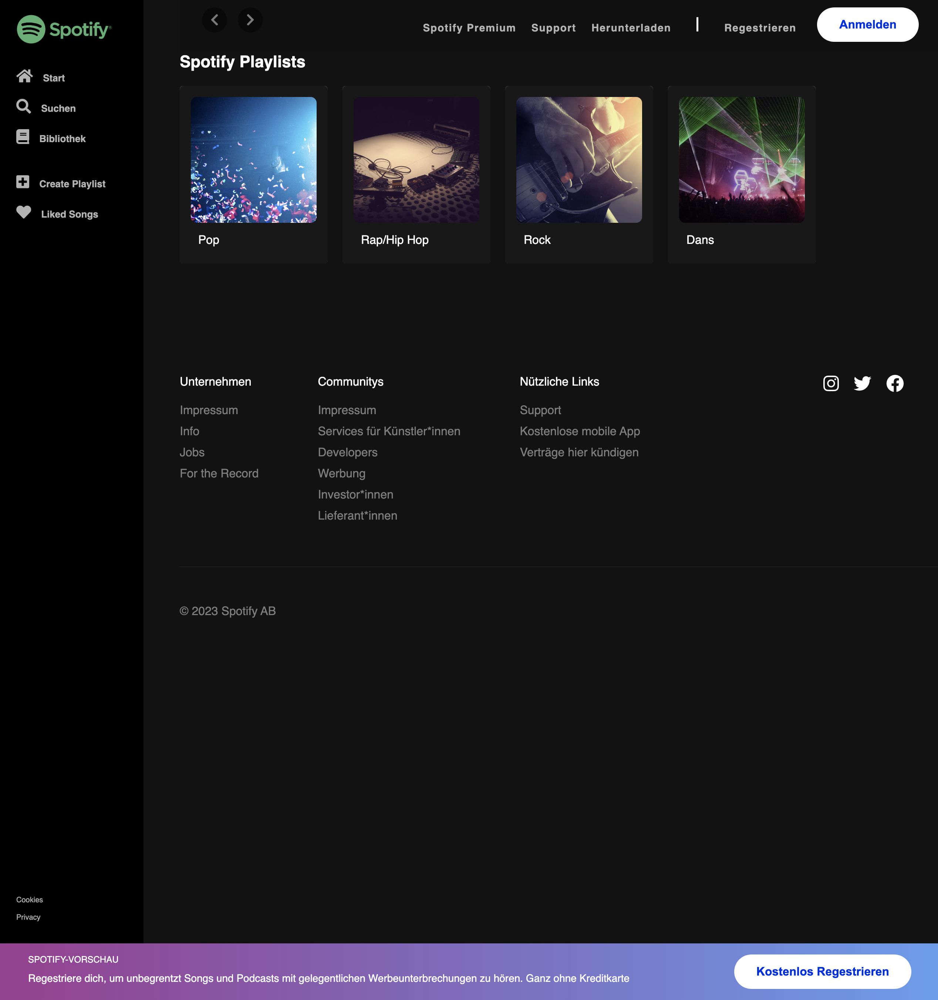

# Spotify-Clone

Willkommen beim Spotify-Klon-Projekt unter Verwendung der Deezer API(oder Rapid API)! Dieses Projekt zielt darauf ab, einige Funktionen von Spotify mithilfe der Deezer API nachzubilden. Dieses Projekt ist eine Teamleistung.

## Projektübersicht

Dieses Projekt umfasst die Erstellung einer Webanwendung mit folgenden Funktionen:

## Login- und Registrierungsseite:

Benutzer können sich anmelden oder in die Anwendung einloggen. Benutzerinformationen werden im JSON-Format gespeichert. Erstellt von: Patrick [Patrick](https://github.com/PatrickZablocki)

## Hauptseite mit Genre-Sektionen:

Die Hauptseite zeigt vier Abschnitte mit verschiedenen Musikgenres an. Benutzer können Musik erkunden, indem sie auf diese Genres klicken. Erstellt von: [Durmus](https://github.com/DrCetmi) und [Patrick](https://github.com/PatrickZablocki)

## Suchseite:

Eine Suchseite ermöglicht es Benutzern, Künstler oder Lieder mithilfe der Deezer API zu suchen. Erstellt von: [Timo](https://github.com/Pflasterlix)

## Bibliothek für favorisierte Lieder:

Benutzer können Lieder als Favoriten markieren, und diese Favoriten werden im lokalen Speicher gespeichert. Es gibt eine dedizierte Bibliotheksseite, die die favorisierten Lieder anzeigt. Erstellt von: [Durmus](https://github.com/DrCetmi)

## Musikleiste für Vorschau:

Eine Musikleiste unten in der Anwendung ermöglicht es Benutzern, auf ein Lied zu klicken und eine Vorschau davon abzuspielen. Erstellt von: [Durmus](https://github.com/DrCetmi)

